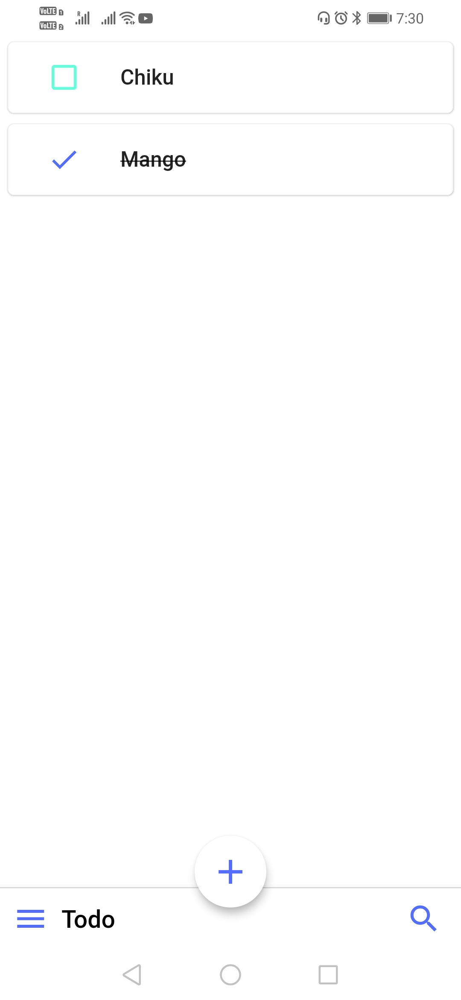
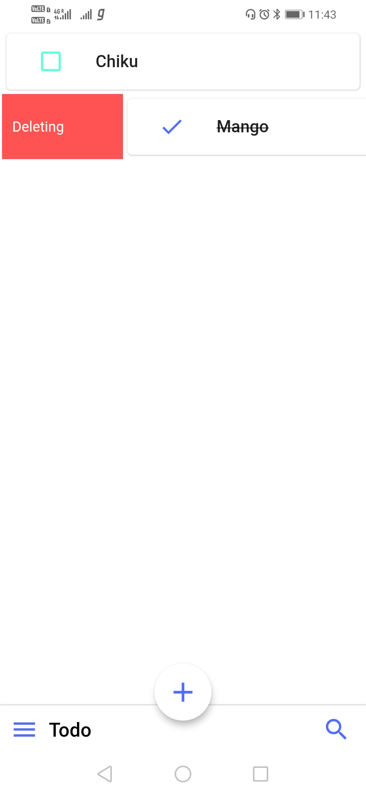

# todo_list_app

A new Flutter application.

## Getting Started

A basic Todo App which saves, updates, deletes a user Todo activities to plan their day. Frontend is designed using dart and it's connected to Sqlite database using Google BLoC (Business Logic Component) structure.
I have used BLoC structure for easy maintainance of application in the long run.

 

Techology Stack -

=> Dart

=> SQLite Database